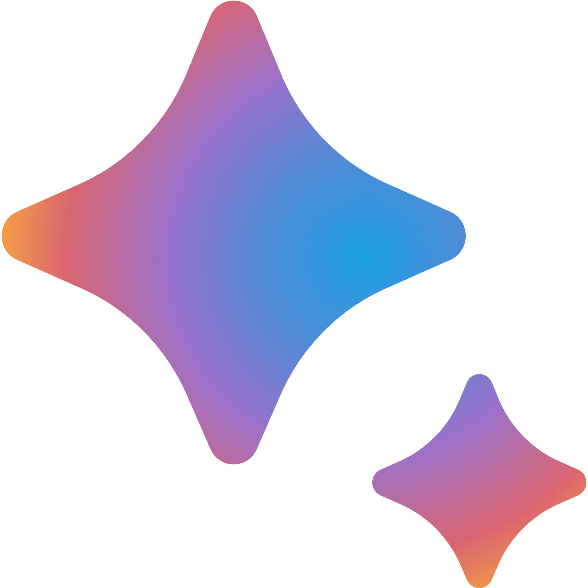

<div align="center">

# 🤖 GeminiAnswerBot

**AI-Powered Quiz Assistant | Asisten Quiz Berbasis AI**

[](https://github.com/rzqllh/GeminiAnswerBot)
[](https://github.com/rzqllh/GeminiAnswerBot)
[](https://ai.google.dev/)



*A Chrome extension that uses Google Gemini AI to analyze quiz questions and provide intelligent answers with explanations.*

*Ekstensi Chrome yang menggunakan Google Gemini AI untuk menganalisis soal quiz dan memberikan jawaban cerdas beserta penjelasannya.*

[🚀 Get Started](#-installation) · [✨ Features](#-features) · [📖 Usage](#-how-to-use) · [🛠️ For Developers](#-for-developers)

</div>

---

## 🌟 What's New in v4.0

| Feature | Description |
|---------|-------------|
| **🎯 Auto-Click Answer** | Automatically selects the correct answer on the quiz page |
| **📊 Confidence Score** | Shows AI confidence level (High/Medium/Low) for each answer |
| **🧠 Context Memory** | Remembers previous Q&A to improve multi-question accuracy |
| **🌐 Multi-Language** | Responds in your preferred language (auto-detect or manual) |
| **🎨 Theme Customization** | Choose from preset themes (Ocean, Sunset, Neon, Midnight) with dark/light modes |
| **📄 PDF Export** | Export your quiz history as a formatted PDF document |

---

## 💡 Why Use This?

**English:**  
Ever been stuck on an online quiz wishing someone could help? This extension does exactly that — it reads the question, understands the context, analyzes all options, and gives you a confident answer with clear reasoning. Unlike simple search tools, GeminiAnswerBot actually *comprehends* what's being asked using Google's advanced AI.

**Bahasa Indonesia:**  
Pernah stuck saat mengerjakan quiz online dan berharap ada yang bisa bantu? Ekstensi ini melakukan hal itu — membaca soal, memahami konteks, menganalisis semua pilihan, dan memberikan jawaban yang akurat dengan penjelasan yang jelas. Berbeda dengan tools pencarian biasa, GeminiAnswerBot benar-benar *memahami* pertanyaan menggunakan AI canggih dari Google.

---

## ✨ Features

| Feature | EN | ID |
|---------|----|----|
| **Smart Detection** | Auto-detects quiz questions on any webpage | Deteksi otomatis soal quiz di website apapun |
| **AI Analysis** | Sends to Gemini AI for context-aware answers | Analisis menggunakan Gemini AI untuk jawaban kontekstual |
| **Visual Solve** | Screenshot mode for image-based questions | Mode screenshot untuk soal berbasis gambar |
| **Live Highlighting** | Highlights correct answer directly on page | Highlight jawaban benar langsung di halaman |
| **Streaming Response** | Watch AI think in real-time | Lihat AI berpikir secara real-time |
| **Explain Mode** | Detailed explanations to help you learn | Penjelasan detail untuk membantu belajar |
| **Custom Prompts** | Create your own AI instruction profiles | Buat profil instruksi AI custom |
| **History & Export** | Review past Q&A, export as JSON/PDF | Lihat riwayat Q&A, ekspor ke JSON/PDF |

---

## 🚀 Installation

### Prerequisites / Prasyarat
- Google Chrome (v88+)
- Gemini API Key (free tier available / tersedia gratis)

### Step-by-Step / Langkah-langkah

1. **Download the extension / Unduh ekstensi**
   ```bash
   git clone https://github.com/rzqllh/GeminiAnswerBot.git
   ```

2. **Open Chrome Extensions / Buka Chrome Extensions**
   - Navigate to `chrome://extensions`
   - Enable **Developer mode** (toggle top-right)
   - Aktifkan **Developer mode** (toggle di kanan atas)

3. **Load the extension / Muat ekstensi**
   - Click **Load unpacked**
   - Select the `GeminiAnswerBot` folder
   - Klik **Load unpacked**
   - Pilih folder `GeminiAnswerBot`

4. **Configure API Key / Konfigurasi API Key**
   - Click extension icon → ⚙️ Settings
   - Get your free key from [Google AI Studio](https://aistudio.google.com/apikey)
   - Paste and save
   - Klik ikon ekstensi → ⚙️ Settings
   - Ambil key gratis dari [Google AI Studio](https://aistudio.google.com/apikey)
   - Paste dan simpan

**Done! You're ready to go. / Selesai! Siap digunakan.**

---

## 📖 How to Use

### Basic Usage / Penggunaan Dasar

1. Go to any quiz page / Buka halaman quiz apapun
2. Click extension icon or press `Alt+Q` / Klik ikon ekstensi atau tekan `Alt+Q`
3. The AI automatically detects and answers / AI otomatis mendeteksi dan menjawab

### Visual Solve Mode / Mode Visual Solve

For image-based or complex questions:
- Click the 📷 camera button
- Select the area to capture
- AI will analyze the screenshot

Untuk soal berbasis gambar atau format kompleks:
- Klik tombol 📷 kamera
- Pilih area yang akan di-capture
- AI akan menganalisis screenshot

### Keyboard Shortcuts

| Key | Action |
|-----|--------|
| `Alt + Q` | Open popup / Buka popup |

Configure at `chrome://extensions/shortcuts`

---

## ⚙️ Settings Overview

Access via extension icon → ⚙️ Settings

| Tab | Description |
|-----|-------------|
| **General** | API key, model selection, temperature |
| **Features** | Auto-click, context memory, display mode, language |
| **Appearance** | Theme presets, color mode (dark/light/auto), accent color |
| **Prompts** | Customize AI instructions for different scenarios |
| **History** | View, export, or clear past interactions |
| **Data** | Backup/restore settings, clear all data |

---

## 🛠️ For Developers

### Project Structure

```
GeminiAnswerBot/
├── manifest.json          # Extension manifest (v3)
├── ui/
│   ├── popup.html         # Main popup interface
│   └── options.html       # Settings page
├── js/
│   ├── popup.js           # Popup logic & state management
│   ├── content.js         # Page content extraction
│   ├── autoclick.js       # Auto-click answer functionality
│   ├── prompts.js         # Default AI prompts
│   ├── services/
│   │   ├── GeminiService.js    # Gemini API handler
│   │   ├── StorageService.js   # Chrome storage wrapper
│   │   └── MessagingService.js # Inter-script communication
│   └── options/
│       ├── options.js     # Settings page controller
│       ├── features.js    # v4.0 features UI
│       ├── history.js     # History management
│       └── nav.js         # Tab navigation
├── assets/
│   ├── popup.css          # Popup styles
│   ├── options.css        # Settings page styles
│   ├── content.css        # Page injection styles
│   └── icon.png           # Extension icon
└── README.md
```

### Key Technologies

- **Manifest V3** - Latest Chrome extension API
- **Gemini API** - Google's generative AI models
- **Chrome Storage API** - Persistent settings storage
- **CSS Variables** - Dynamic theming system
- **EventBus Pattern** - Internal state communication

### Development Setup

```bash
# Clone repository
git clone https://github.com/rzqllh/GeminiAnswerBot.git
cd GeminiAnswerBot

# Load in Chrome (no build step required)
# 1. Go to chrome://extensions
# 2. Enable Developer mode
# 3. Click "Load unpacked"
# 4. Select project folder

# After making changes, click the refresh button on the extension card
```

### Contributing

1. Fork the repository
2. Create feature branch: `git checkout -b feature/your-feature`
3. Commit changes: `git commit -m "Add your feature"`
4. Push: `git push origin feature/your-feature`
5. Open a Pull Request

---

## 🔒 Privacy

| Data | Storage |
|------|---------|
| API Key | Local Chrome encrypted storage only |
| Quiz Content | Sent only to official Gemini API |
| User Data | Never collected or transmitted |
| Source Code | Fully open source for audit |

---

## 📬 Contact

- **GitHub Issues:** [Report bugs / Request features](https://github.com/rzqllh/GeminiAnswerBot/issues)
- **Email:** rzqllh18@gmail.com

---

## 📄 License

MIT License — Free to use, modify, and distribute.

---

<div align="center">

**Built with ☕ by [Hafizh Rizqullah](https://github.com/rzqllh)**

*If this helped you, consider giving a ⭐*

*Kalau ini membantu, pertimbangkan untuk kasih ⭐*

</div>
